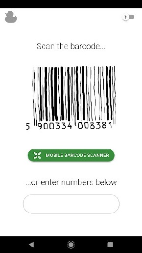

# KAO - Documentation

The following document provides the documentation of most important features and typical usage workflows for bar**K**ode **A**ttachment to **O**penfoodfacts in Vue. 

## 1. Installation

There are 2 ways for installing the project. The instructions for [end users](#end-users) and [developers](#developers) is described in the appropriate sections below. 

### End-Users

-----

To install the app on Android navigate to Google Play Store and download and install `KAO - barKode Attachment to Openfoodfacts`. Then continue to [Usage Guide](#2-usage-guide). 

### Developers

In order to run the development version of this application you must have 

- `Git` installed for your system
- `Node` and `npm` installed
- `Quasar` framework installed
    ```
    npm -i -g quasar
    ```

To run this application in development mode clone the repository, navigate to [quasar-project](../quasar-project/) directory, install dependencies and start the development server

```sh
git clone https://github.com/jzaprzalka/kao
cd kao/quasar-project/
npm install 
quasar dev
```

Once the project finishes building and the app is ready, navigate to the URL displayed in your console output (e.g. http://localhost:8080 - the URL differs relative to the ports that are free on your machine) in your browser. Suggested browser are Google Chrome or Mozilla Firefox. In the browser go to `developer tools` or `Inspect Element` (available in suggested browsers under `F12`) and change display device to a mobile phone for best perspective - the app was designed for mobile phones and thus provides the best UX when viewing in this manner.

Afterwards proceed to [Usage Guide](#2-usage-guide) below.

## 2. Usage Guide

All screens in the application have 2 themes (light and dark). There is a toggle in the upper right corner of the screen to change the theme. 

First and main screen of the application is the Language Selection Screen. The language selected here impacts the search in `OpenFoodFacts` database and the language this data is displayed in. If that is irrelevant to you, or you just want to search the `World` section of `OpenFoodFacts`, Ignore the dropdown (don't select anything) and proceed to the next screen. 


The next page is the place to scan or enter the barcode in order to search for the product in `OpenFoodFacts`. After the barcode has been successfully recognized by the scanner the input is filled out automatically. 


**Note**: if the input is currently focused, the scanner will not be working; i.e. if one is or was trying to enter the barcode by hand, but instead wants it scanned, one shall exit the input and keep it out of UX focus until it is filled out with the scanned barcode correctly.

Mobile app's view is slightly different. MOBILE BARCODE SCANNER button opens camera view then waits until the code is scanned.




To proceed from this screen one shall focus the input and click `return` / `submit` on the keyboard. The screen that follows represent the details of the scanned product. To display the full-size image of the product one can click the splash screen with the fragment

<!-- 
 -->


In any moment in the application, to navigate back one should use the `back` key on the phone or browser's `previous page` button.
